# Asteroids game
This is a simple game which is built step by step from https://wiki.gdevelop.io/gdevelop5/tutorials/asteroids/start

## Demo
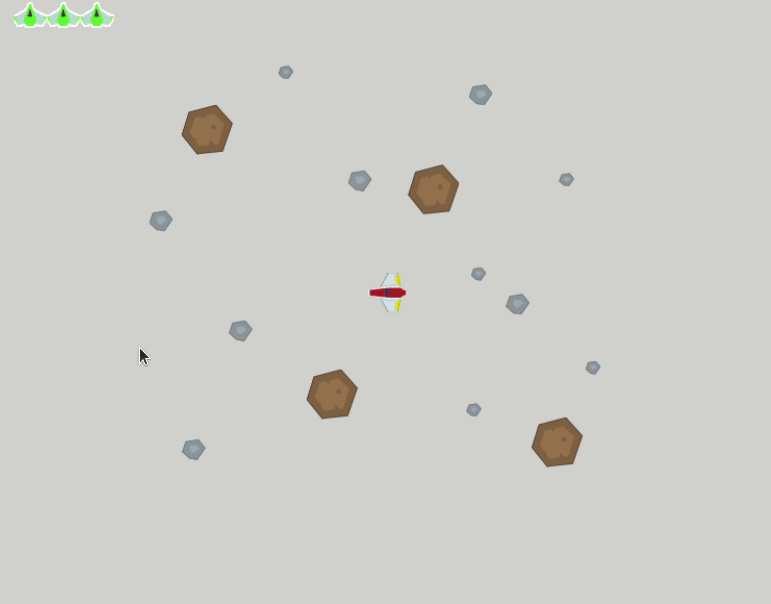

## Preview
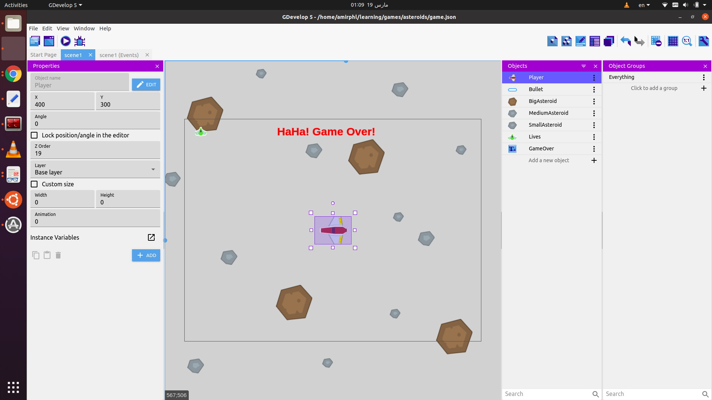

## Objects
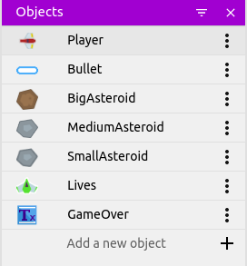

## Groups
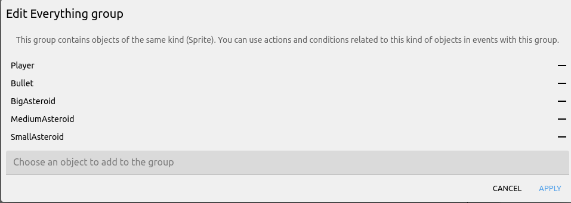

## Player points
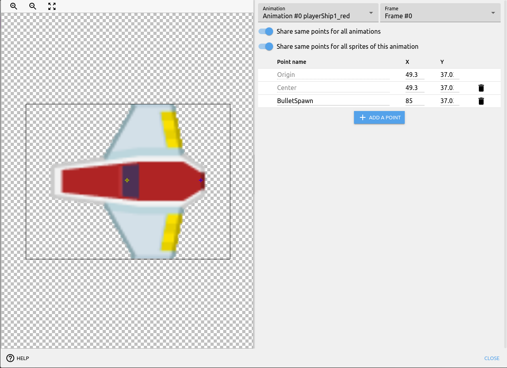

## Player Health and Physics Behavior
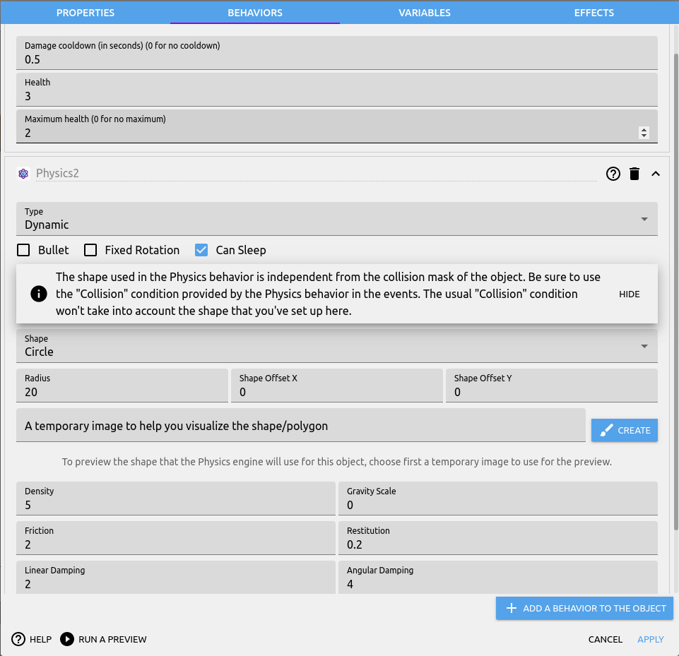

## Asteroid Behavior
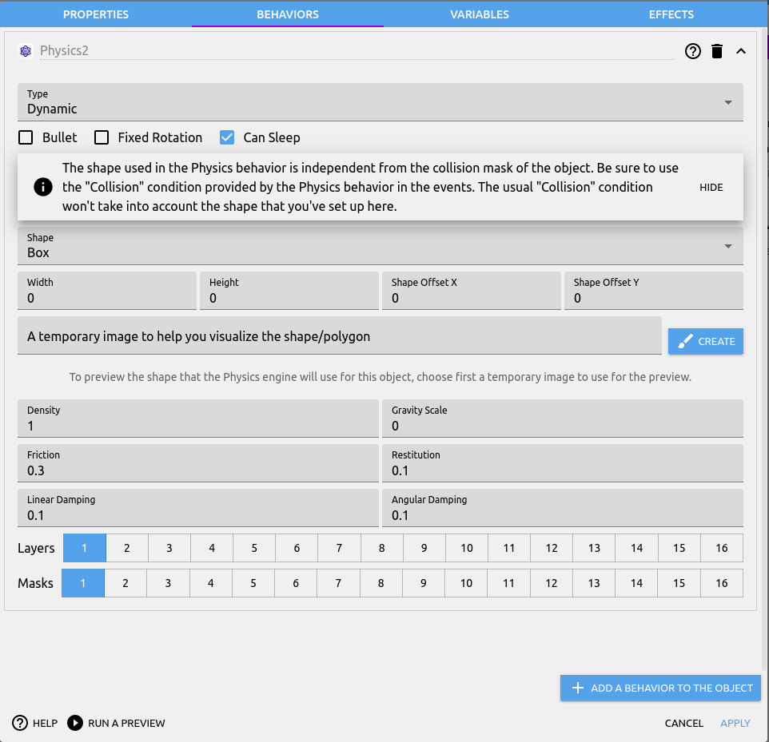

## Layers
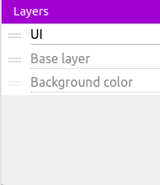

## Health Behavior
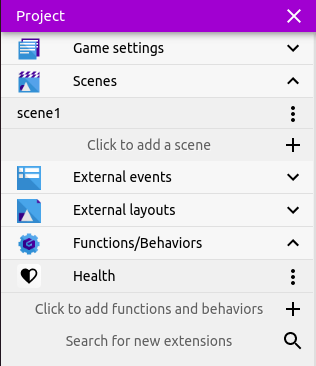

## Health UI Layer
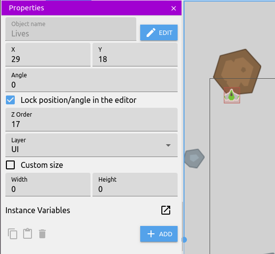

## Why does the Bullet has no effect on the Player itself?
Because it doesn't have Physics2 behavior.  
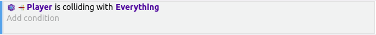

## Events - set 1
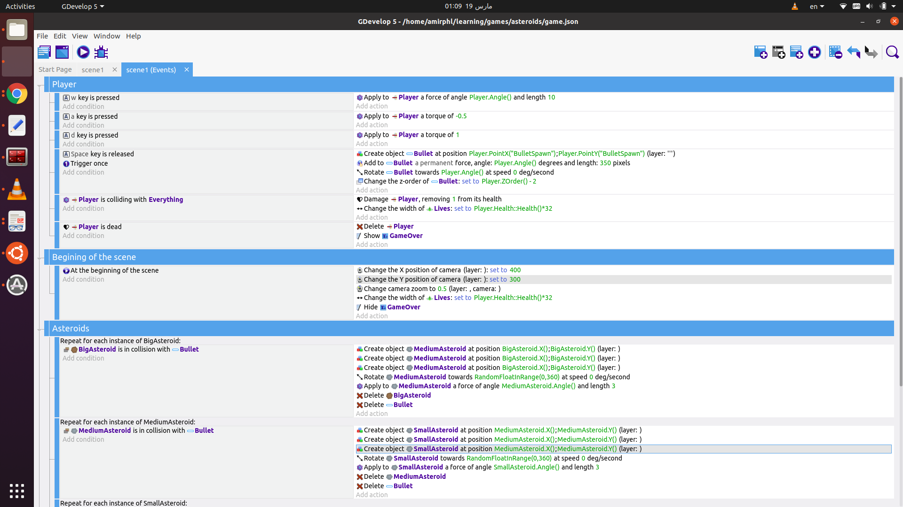

## Events - set 2
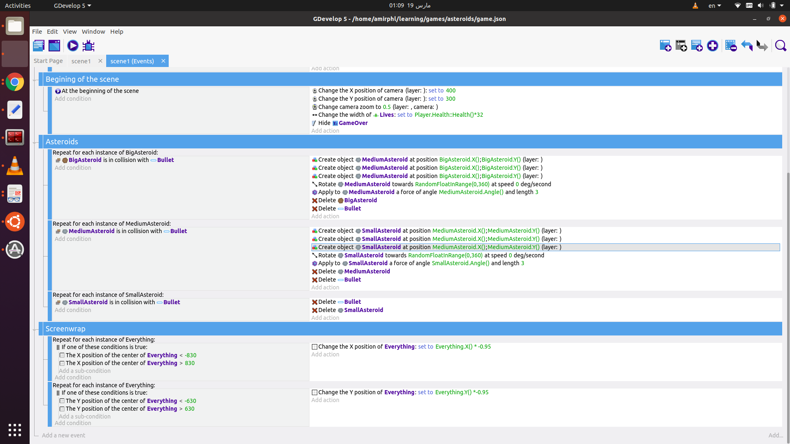
