# Platformer game
This is a simple game which is built step by step from https://wiki.gdevelop.io/gdevelop5/tutorials/platformer/start  

## Preview
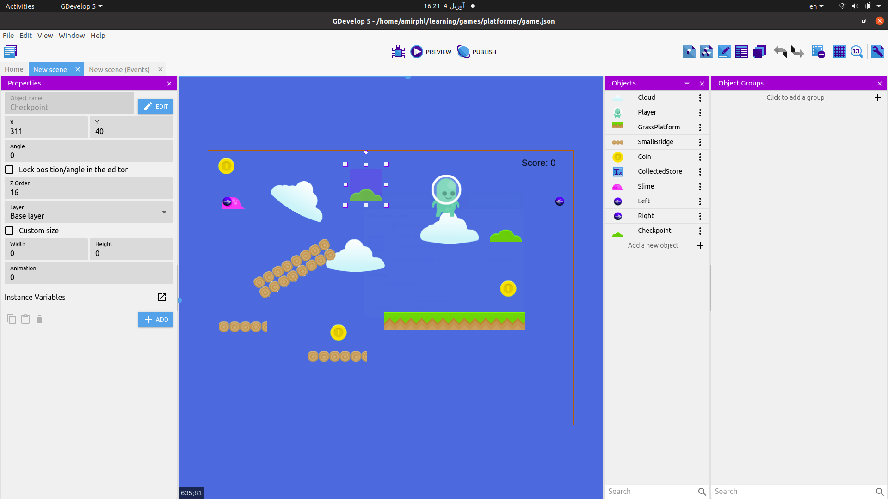

## Objects
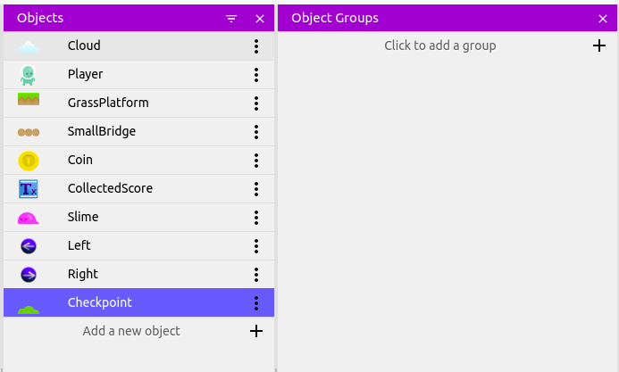

## Player Animations
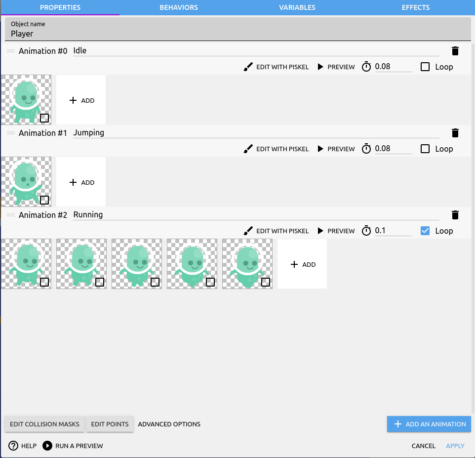

## Player Behaviors - Platformer Object

## Slim Animations
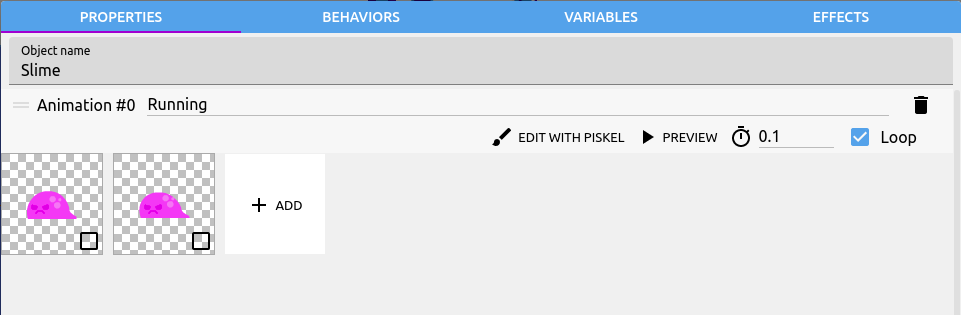

## Slim Variables
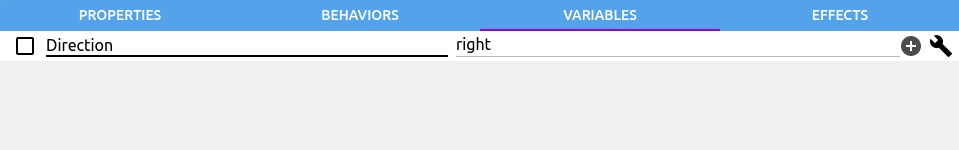

## Grass Object
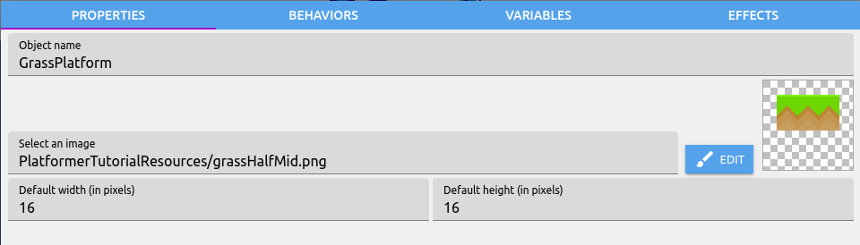

## Grass Behavior - Platform
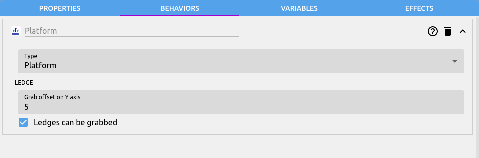

## Bridge Object
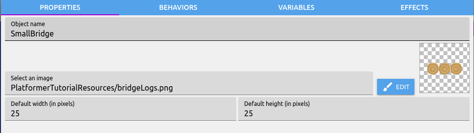

## Bridge Behavior - Platform

## Layers
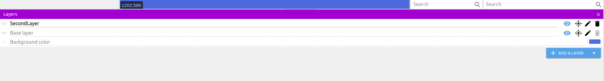

## Bridge - Base Layer
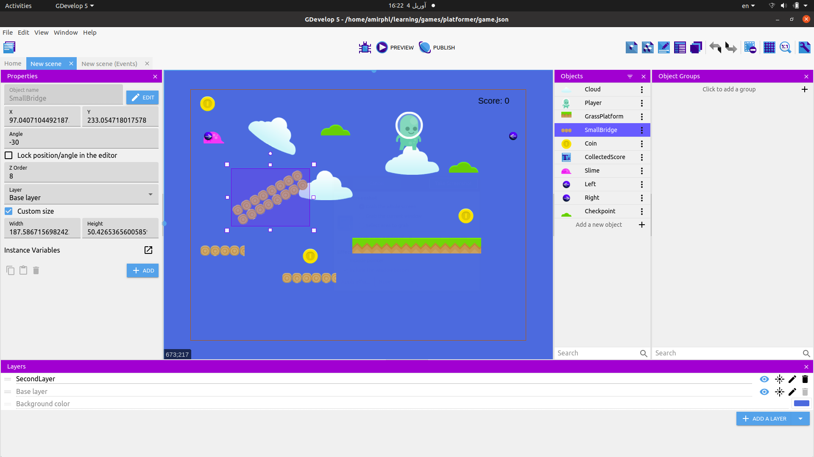

## Events
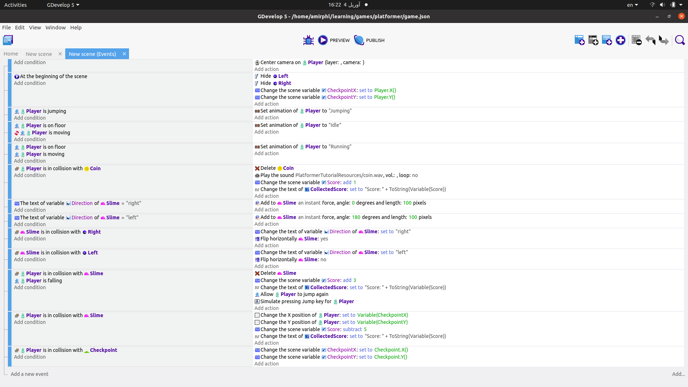
